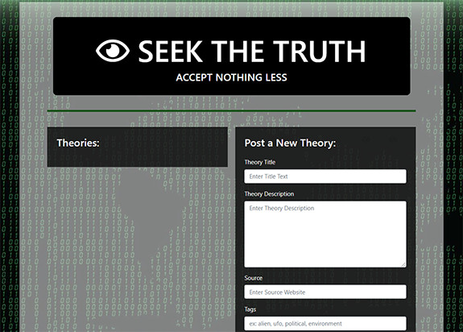

# Seek The Truth
> This project was created for Coding Bootcamp Project 2.
## Deployed App
https://seek-the-truth-final.herokuapp.com/home

## Table of contents
* [General info](#general-info)
* [Screenshots](#screenshots)
* [Technologies](#technologies)
* [Features](#features)
* [Status](#status)
* [Inspiration](#inspiration)
* [Group Members](#group-members)
* [Contact](#contact)

## General info
Project 2 focused a lot on back end development so we decided to have fun with it. This app will take in notes about conspiracy theories, create posts and (eventually) allow others to respond. My work focused on front end design and I included a few Easter Eggs!
  
Follow this link to view our group [presentation](https://docs.google.com/presentation/d/1nZOF2Mcaz3njwW0PcSyzVna6A7nbxA8mKkKfcgY6bW8/edit?usp=sharing).

## Screenshots
### Concept
 
### Deployed Site

## Technologies
* MySQL
* handlebars.js
* JavaScript
* Bootstrap

## Code Examples
    .hidden {
        margin: auto 25px;
        float: right;
        color: rgba(0, 0, 0, 0.1);
        font-size: 20px;
    }

## Features
List of features ready and TODOs for future development:
### Features
* Write and post new conspiracy theories.
* Read other's posts.
* Delete posts already created.
### Future Development
* Login and account so you can only delete your own posts.
* Fix database to keep posts and display them to all users.
* Verifying sources function has only minimal usage.
* Ability to search by tag.

## Status
Project is: _finished_

## Inspiration
Inspired by a love of having fun and spoofing conspiracy theories.
Based on the project 2 assignment for The Coding Bootcamp at UT Austin.

## Group members:
* Elise Hammons: https://github.com/EHammons
* Bailey Beck: https://github.com/baileymbeck
* Fauz Ahmed: https://github.com/therealfez
* Gordon Coutret: https://github.com/Gccoutret

## Contact
Created by Elise Hammons (and project group 2) - feel free to contact me!
 [LinkedIn](https://www.linkedin.com/in/elise-h-01243258/)